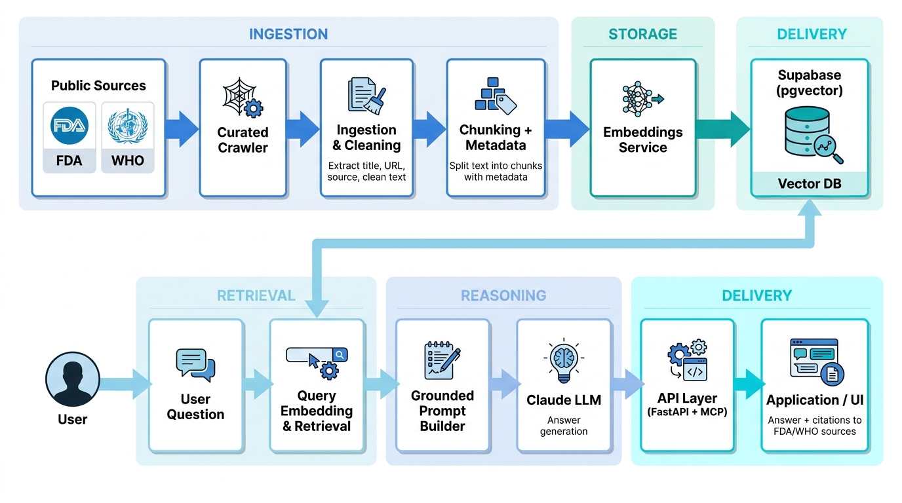
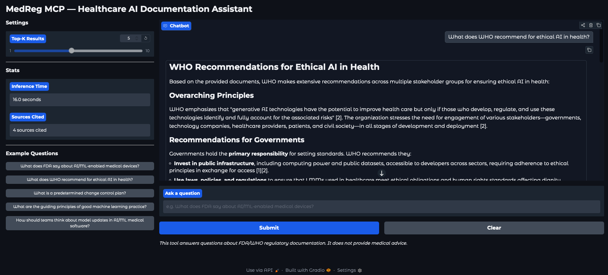

# Medical RAG

A healthcare AI documentation agent that helps technical and product teams answer questions about responsible AI in regulated medical contexts, using cited retrieval over public FDA and WHO documentation.

It exposes the same knowledge base through both **FastAPI** and an **MCP server** so it can be used by applications and Claude-compatible clients.

> **Note:** This is NOT a medical diagnosis or treatment tool. It is a regulatory and responsible AI documentation assistant.

## Demo

[Watch the demo on Loom](https://www.loom.com/share/d06f324022714527a00d1ff94a460e68)

## Folder Structure

```
medical-rag/
├── app/
│   ├── __init__.py
│   ├── main.py            # FastAPI application
│   ├── config.py          # Environment and settings
│   ├── schemas.py         # Pydantic models
│   ├── rag.py             # RAG pipeline orchestration
│   ├── prompts.py         # LLM prompt templates
│   ├── citations.py       # Citation extraction and formatting
│   ├── safety.py          # Medical advice detection
│   ├── vector_store.py    # Supabase pgvector operations
│   ├── embeddings.py      # Amazon Titan embedding client
│   └── llm.py            # Claude LLM client via Bedrock
├── ingestion/
│   ├── __init__.py
│   ├── sources.py         # FDA/WHO URL definitions
│   ├── crawler.py         # Web page fetcher and parser
│   ├── chunker.py         # Text splitting logic
│   └── ingest.py          # Ingestion pipeline entrypoint
├── mcp_server/
│   ├── __init__.py
│   ├── server.py          # MCP server setup
│   └── tools.py           # Tool definitions for Claude clients
├── evals/
│   ├── eval_questions.json # 15 Q&A evaluation pairs
│   ├── run_eval.py        # Evaluation runner
│   └── metrics.py         # Scoring functions
├── scripts/
│   ├── setup_db.sql       # Supabase table and index setup
│   └── demo_queries.sh    # Example curl commands
├── tests/
│   ├── test_safety.py     # Safety filter tests
│   ├── test_chunking.py   # Chunker tests
│   └── test_citations.py  # Citation logic tests
├── assets/
│   ├── diagram.png        # Architecture diagram
│   └── demo.png           # Gradio demo screenshot
├── demo.py                # Gradio chat interface
├── requirements.txt
├── .env.example
└── .gitignore
```

## Architecture



## Setup

### 1. Prerequisites

- Python 3.11+
- AWS account with Bedrock access (Claude Opus 4.6 + Amazon Titan Embeddings)
- Supabase project with pgvector enabled

### 2. Install Dependencies

```bash
python -m venv venv
source venv/bin/activate
pip install -r requirements.txt
```

### 3. Configure Environment

```bash
cp .env.example .env
```

Edit `.env` with your credentials:

```env
SUPABASE_URL=https://your-project.supabase.co
SUPABASE_KEY=your-supabase-anon-key
AWS_REGION=us-east-1
AWS_ACCESS_KEY_ID=your-key
AWS_SECRET_ACCESS_KEY=your-secret
```

AWS credentials can also come from `~/.aws/credentials` or IAM roles if you leave the key fields unset.

### 4. Set Up Database

Run `scripts/setup_db.sql` in your Supabase SQL Editor. This creates:
- The `documents` table with a `vector(1536)` column
- An HNSW index for cosine similarity search
- A `match_documents` RPC function

Also disable RLS for the demo (or add appropriate policies):

```sql
alter table documents disable row level security;
```

### 5. Ingest Documents

```bash
python -m ingestion.ingest
```

This crawls the following public FDA and WHO pages, chunks the text, generates embeddings via Amazon Titan, and stores everything in Supabase.

#### Sources Crawled

**FDA:**
| Document | URL |
|----------|-----|
| AI/ML in Software as a Medical Device | https://www.fda.gov/medical-devices/software-medical-device-samd/artificial-intelligence-and-machine-learning-software-medical-device |
| AI/ML-Enabled Medical Devices | https://www.fda.gov/science-research/science-and-research-special-topics/artificial-intelligence-and-machine-learning-aiml-enabled-medical-devices |
| Predetermined Change Control Plans for ML-Enabled Medical Devices | https://www.fda.gov/medical-devices/software-medical-device-samd/predetermined-change-control-plans-machine-learning-enabled-medical-devices |
| Good Machine Learning Practice for Medical Device Development | https://www.fda.gov/medical-devices/software-medical-device-samd/good-machine-learning-practice-medical-device-development-guiding-principles |
| Digital Health Criteria | https://www.fda.gov/medical-devices/digital-health-center-excellence/digital-health-criteria |

**WHO:**
| Document | URL |
|----------|-----|
| Ethics and Governance of AI for Health | https://iris.who.int/bitstream/handle/10665/341996/9789240029200-eng.pdf |
| Regulatory Considerations on AI for Health | https://www.who.int/publications/i/item/9789240078871 |
| WHO Guidance on Ethics and Governance for Large Multi-Modal Models | https://www.who.int/news/item/18-01-2024-who-releases-ai-ethics-and-governance-guidance-for-large-multi-modal-models |
| WHO Considerations for Regulation of AI for Health | https://www.who.int/news/item/19-10-2023-who-outlines-considerations-for-regulation-of-artificial-intelligence-for-health |
| Ethics and Governance of AI for Health - Guidance on LLMs | https://www.who.int/publications/i/item/9789240084759 |

The source list is defined in `ingestion/sources.py` and can be extended.

## Usage

### FastAPI Server

```bash
uvicorn app.main:app --reload
```

Query the API:

```bash
curl -X POST http://localhost:8000/ask \
  -H "Content-Type: application/json" \
  -d '{"question": "What does FDA say about AI/ML-enabled medical devices?"}'
```

Response:

```json
{
  "answer": "Based on the provided sources, the FDA defines AI as...[1][2]",
  "citations": [
    {
      "source_title": "AI/ML-Enabled Medical Devices",
      "source_url": "https://www.fda.gov/...",
      "snippet": "..."
    }
  ],
  "safety_triggered": false
}
```

Safety-triggered response (medical advice request):

```bash
curl -X POST http://localhost:8000/ask \
  -H "Content-Type: application/json" \
  -d '{"question": "Should this patient receive treatment A or treatment B?"}'
```

```json
{
  "answer": "I cannot provide medical advice or treatment recommendations...",
  "citations": [],
  "safety_triggered": true
}
```

### Gradio Demo

A chat-style web interface for interactive Q&A:

```bash
python demo.py
```

Opens at `http://localhost:7860` with:
- Chat interface with conversation history
- Sidebar with Top-K slider, inference time, and source count stats
- Clickable example questions
- Markdown-rendered answers with citation links



### MCP Server

Connect from Claude Desktop by adding to `claude_desktop_config.json`:

```json
{
  "mcpServers": {
    "medreg": {
      "command": "python",
      "args": ["-m", "mcp_server.server"],
      "cwd": "/path/to/medical-rag"
    }
  }
}
```

The server exposes one tool: `query_healthcare_ai_docs`

**Tool schema:**
- **Name:** `query_healthcare_ai_docs`
- **Input:** `question` (string) — A question about healthcare AI regulation, responsible AI, or medical device software
- **Output:** Cited answer text with appended source list

## Evaluation

Run the evaluation suite (15 Q&A pairs testing citation quality, safety, keyword recall, and source accuracy):

```bash
python -m evals.run_eval
```

Metrics reported:
- **Safety accuracy** — correctly blocks medical advice, allows regulatory questions
- **Citation presence** — answers include source citations
- **Keyword recall** — answers contain expected domain terms
- **Source org accuracy** — citations come from the expected organization (FDA/WHO)

## Tests

```bash
pytest tests/ -v
```

Covers:
- `test_safety.py` — medical advice detection and safe pass-through of regulatory questions
- `test_chunking.py` — text splitting respects token limits and preserves content
- `test_citations.py` — citation extraction, deduplication, and edge cases

## Design Decisions

| Decision | Choice | Rationale |
|----------|--------|-----------|
| LLM | Claude Opus 4.6 via AWS Bedrock | High reasoning quality for cited answers |
| Embeddings | Amazon Titan Text v1 (1536d) | No extra API key, same AWS credentials |
| Chunk size | 800 tokens, 100 overlap | Preserves regulatory context without noise |
| Top-k | 5 | Sufficient diversity for multi-faceted questions |
| Citation format | Inline `[1]`, `[2]` with source list | Familiar, parseable, verifiable |
| Safety | Regex patterns | Fast, deterministic, no extra LLM cost |
| MCP transport | stdio | Standard for local MCP servers |
| Vector store | Supabase + pgvector | Managed, scalable, good DX |

## Production Considerations

If deploying this to production, I would additionally:

- Add rate limiting and authentication to the FastAPI endpoint
- Implement caching for repeated queries (embedding + search results)
- Add monitoring/observability (latency, token usage, safety trigger rate)
- Set up periodic re-ingestion as FDA/WHO documents update
- Add a feedback loop to improve retrieval quality
- Consider hybrid search (keyword + vector) for better recall
- Add request tracing for debugging citation quality issues
- Deploy the MCP server as an SSE endpoint for remote access
- Use the Supabase RPC function for vector search at scale (current local similarity computation is fine for small document sets but won't scale)
